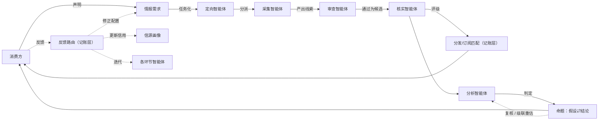
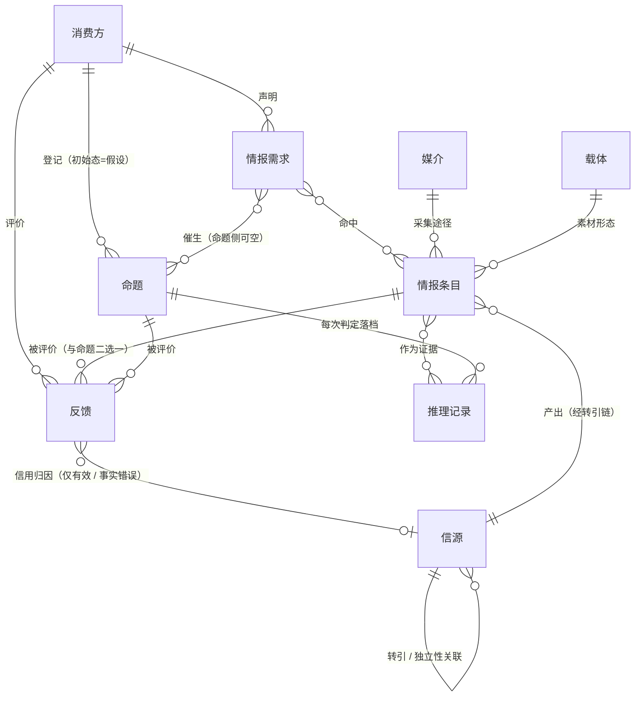
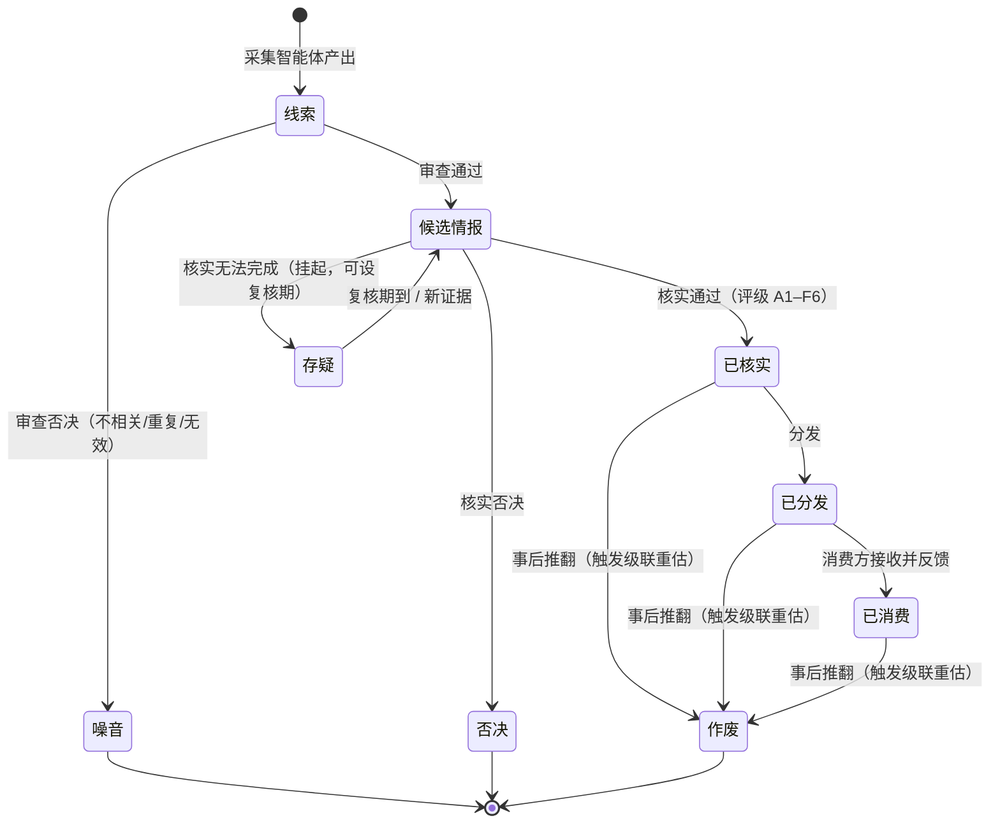
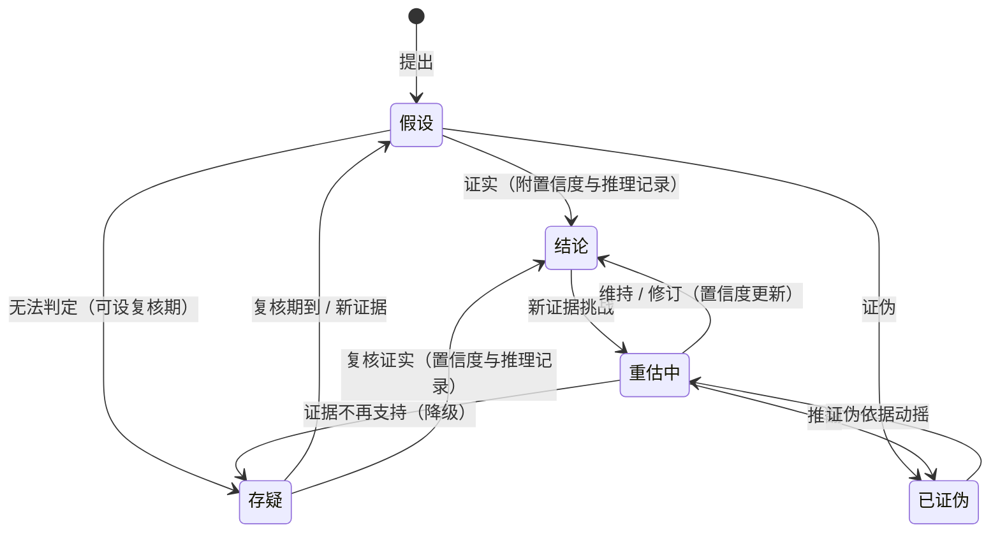
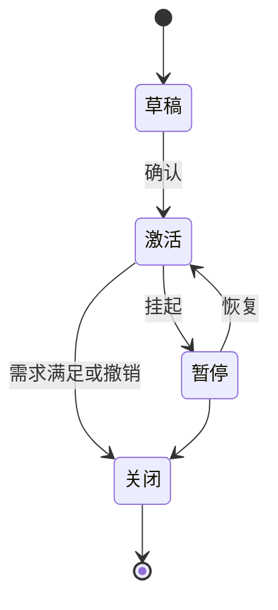

# IIH 领域模型

> 术语以[术语表](doc-03%20-%20术语表-Glossary.md)为准，本文不重复定义；架构分层见 decision-01，全部决策见 `backlog/decisions/`。

## 1. 总览

一句话：**媒介是"在哪儿拿到的"，载体是"什么形态"，信源是"谁说的"，情报是"说了什么"，命题是"我们信什么"。**

系统 = 经典情报循环（定向 → 采集 → 处理 → 分析 → 分发 → 反馈）的智能体化 + 类型化反馈闭环，全景见 §2。

## 2. 流水线与闭环

### 2.1 智能体分工

| 智能体 | 输入 | 输出（提案） |
|---|---|---|
| 定向 | 情报需求（订阅 / 任务） | 采集任务：目标信源与媒介、检索参数、采集节奏 |
| 采集 | 采集任务、原始素材（处理管线按载体：ASR / OCR / 解析） | 线索：陈述内容 + 溯源引用 |
| 审查 | 线索 | 候选情报，或否决为噪音（附理由） |
| 核实 | 候选情报，可检索外部信源佐证 | 评级（A1–F6）；无法完成则挂存疑，有反证则否决 |
| 分析 | 已核实条目、既有命题 | 判定：证实 / 证伪 / 存疑，附置信度与推理记录 |

智能体不直接写账，输出一律为提案（产出 + 依据），经记账层校验后落账，无溯源不落账（decision-01）。分发/订阅匹配、反馈路由、信用计算为记账层确定性机制，不设智能体——五类智能体即流水线上的全部判断点。各智能体的无状态工具（抓取 / 解析 / 检索 / 存储读写）属工具层，清单属实现设计，随实现另行沉淀。

## 3. 实体与关系

**走查示例**——「W 公司合资传闻调查」：用户（消费方）声明两个情报需求，一条业务路径走到图中全部关系，约束仍以图为准：

| 实体 / 关系 | 本例 |
|---|---|
| 情报需求 · 订阅 | R1「长期跟踪 W 公司动态」 |
| 情报需求 · 任务 | R2「两周内查明 W 与 Z 的合资传闻」 |
| 命题 · 催生 | R2 催生 C1「W 与 Z 将成立合资公司」，先为假设 |
| 信源 · 转引 / 独立性 | S2 = W 官网（一次信源）；S1 = 行业资讯站，转载 S2——同链只计 **1 个独立信源** |
| 媒介 / 载体 | 互联网 / 网页，记入溯源 |
| 情报条目 · 产出 | I1 = 事件级合并后的一条情报（核心陈述：W 与 Z 合资；转引链含 S1 转载与 S2 公告原文，各家原文以快照留存） |
| 命中（多对多） | I1 同时命中 R1 与 R2 |
| 推理记录 · 证据 | 分析智能体判定 C1 证实（置信度：中），引用 I1；C1 转为结论 |
| 反馈 · 信用归因 | 用户对 I1 标「有效」→ 归因到链上最早陈述方 S2：S2 信用 ↑，如实转载的 S1 不动（decision-10） |

本例未走到：事实错误打在命题上（目标的另一侧）→ 直接进入重估中（§6）。

属性级数据设计见[数据设计](doc-04%20-%20数据设计-Data-Design.md)。

## 4. 状态机

### 4.1 情报条目

要点：能完成评定的给弱评级（4–6）仍为已核实；核实无法完成才挂存疑。

### 4.2 命题

要点：每次状态迁移都落一条推理记录。

### 4.3 情报需求

## 5. 评级体系（Admiralty / NATO 二维制）

| 维度 | 评级 | 维护者 |
|---|---|---|
| 信源可靠度 | A 完全可靠 ｜ B 通常可靠 ｜ C 相当可靠 ｜ D 通常不可靠 ｜ E 不可靠 ｜ F 无法判断 | 信源画像（反馈驱动） |
| 内容可信度 | 1 已被独立信源证实 ｜ 2 很可能为真 ｜ 3 可能为真 ｜ 4 可疑 ｜ 5 不太可能 ｜ 6 无法判断 | 核实智能体（独立信源交叉） |

两维正交，书写形如 **B2**（选型依据见 decision-08）。

### 5.1 评级重评（decision-09）

已核实条目可由核实智能体重新评定，经提案落账；评级历史版本化保留（可重放），下游引用取当前值。触发器：新印证合并（decision-02）｜信源信用分档迁移（decision-04）｜人工触发｜评级异议（§6）。

## 6. 反馈类型与路由

反馈的后果分两层：**处置**（对被评价目标的即时动作：作废、重估、重评）与**学习**（三通路：信源信用、需求/采集配置、智能体迭代）。只有有效 / 事实错误动信用，经信用归因（decision-10）落到唯一责任信源；命题反馈仅作用于结论态，除事实错误触发重估外不改信用与配置；反馈默认可信（单人前提），多消费方出现时另行决策重启。

| 反馈类型 | 处置（对目标） | 信用 | 配置 | 迭代 |
|---|---|---|---|---|
| 有效 | — | ↑ | 正向微调 | — |
| 事实错误 | 条目 → 作废并级联重估；命题 → 直接进入重估中 | ↓↓ | — | 核实收紧（独立信源计数要求提高） |
| 不相关 | — | — | 需求 / 采集修正 | — |
| 过期 | — | — | 采集频率、时效参数 | — |
| 重复 / 噪音 | — | — | — | 审查（去重 / 初筛） |
| 评级异议 | 触发评级重评（§5.1） | — | — | — |
