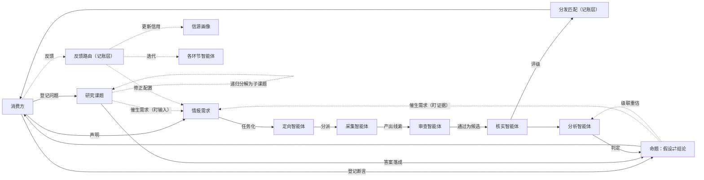
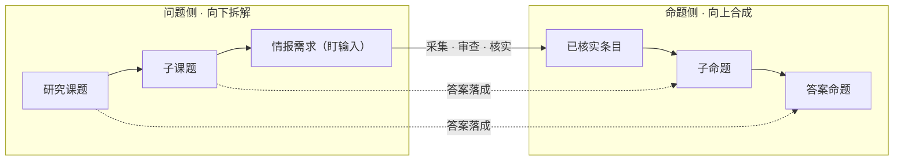
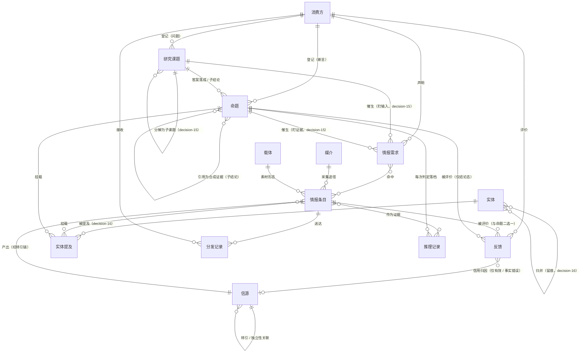
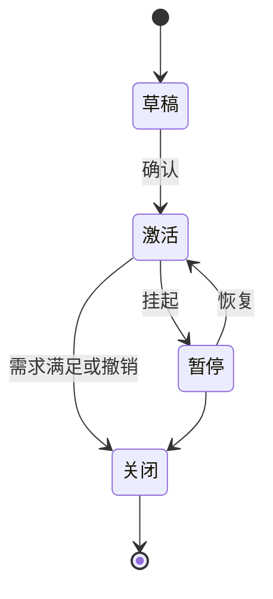
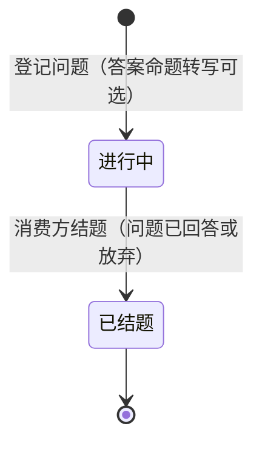
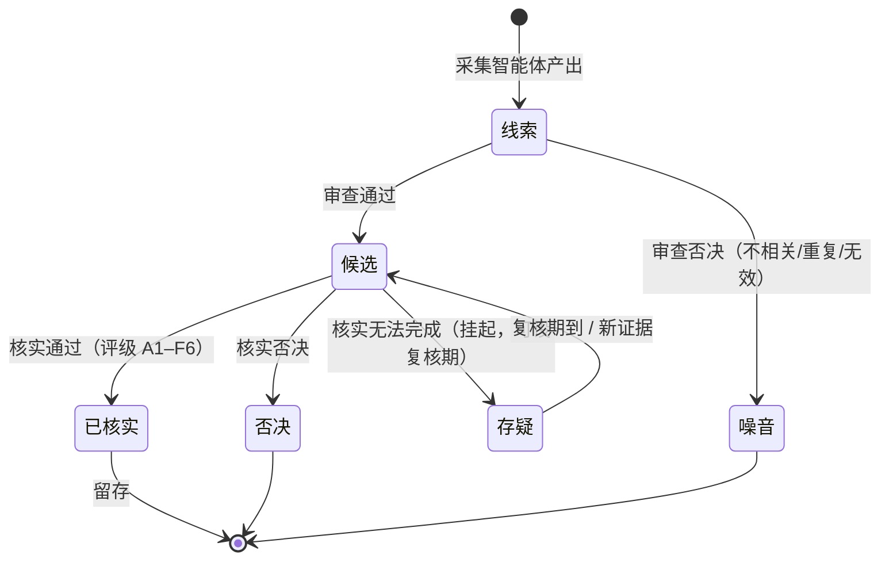
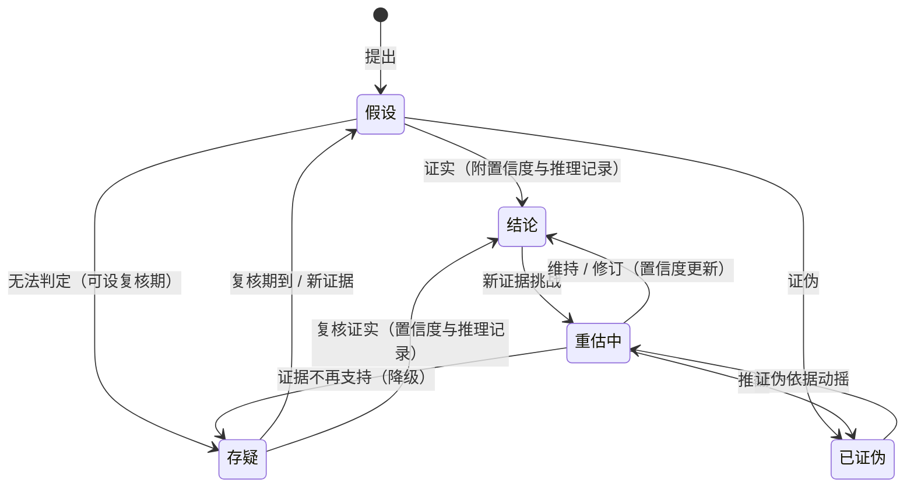

# IIH 领域模型

> 术语以[术语表](doc-03%20-%20术语表-Glossary.md)为准，本文不重复定义；架构分层见 decision-01，全部决策见 `backlog/decisions/`。

## 1. 总览

一句话：**媒介是"在哪儿拿到的"，载体是"什么形态"，信源是"谁说的"，情报是"说了什么"，研究课题是"想知道什么"，命题是"信什么、求证什么"，实体是"说的是谁"（知识底座）。**

系统 = 经典情报循环（定向 → 采集 → 处理 → 分析 → 分发 → 反馈）的智能体化 + 类型化反馈闭环，全景见 §2。

## 2. 流水线与闭环

**拆解与合成，一降一升**（decision-15 的骨架）：研究课题侧自上而下——消费方登记研究课题，定向智能体按提示词递归分解为子课题与情报需求（盯输入）；命题侧自下而上——叶子课题的答案从已核实条目判定（求证核实），非叶子课题的答案取子命题按框架合成（逻辑合成）。两线在每层「答案落成」处衔接：拆解产出的是**问题**，落成的才是**命题**；置信度沿命题合成 DAG 向根命题逐层计算，情报作废沿同一 DAG 触发级联重估。研究课题只管问题生命周期，命题独立存续、不受结题影响；独立登记的断言不挂研究课题，直接进命题侧求证。

五类智能体各为流水线上的一个判断点，输入/职责/输出/工具契约见[智能体规约](doc-06%20-%20智能体规约-Agent-Specification.md)。

## 3. 实体与关系

**实体层（知识底座，decision-16）**：实体是世界对象（机构 / 人物 / 产品 / 技术 / 地域等，类型集合随实现演进），经**实体提及**挂载于情报条目与命题——采集智能体自陈述抽取（随条目新建提案落账，新实体随提及建立），审查智能体做**实体归一**（同一性判定；归并既有实体走提案 + 消费方确认，参照 decision-09）。两条硬边界：**实体间关系边不落账**——由条目 / 命题的提及共现派生（投影），图谱视图与检索用；投影可物化、随提及与归并增量维护、可自账本全量重建，「不落账」指不入正本（不承载独立真值与溯源）、非不入库。**实体不进判定链**——命题证据仍为情报条目 / 子命题，归并不触发级联重估。实体无状态机，归并 / 拆分为留痕操作；图连通度是测量变量（审查相关性参考，不作有效性规则），图谱视图中的断连孤岛作新话题探测器（提示声明新情报需求）。本节其余对象为系统记账对象，与实体（世界对象层）分属两层。

**问题树走查**——「自动装车市场空间有多大？」。消费方要的是**答案**而非情报流，故登记研究课题；走查沿 ER 图的关系，约束以图为准。

**① 登记**　消费方登记研究课题 T2「自动装车市场空间有多大？」，可选附上测算框架（提示词）。→ 系统建 T2，状态进行中。

**② 向下拆解**　定向智能体按提示词把 T2 递归分解为子课题——每种测算法一个：T2a「单元存量法」、T2b「工作量产能法」……子课题拆到叶子，催生盯输入的情报需求（如「特大型矿座数」「单元数 / 配置区间」），各自驱动主动采集。拆解产出的是**问题**，此刻还没有答案。

**③ 采集入库**　各叶子情报需求 → 采集任务 → 采集智能体产出线索 → 审查放行 → 核实评级，已核实条目入库并挂实体提及（如「W 公司」「矿卡」），命中对应需求。

**④ 向上合成**　叶子课题的分析智能体从已核实条目判定出子命题：C2a「1,351–3,336 台」、C2b「1,620–3,500 台」，各落推理记录、置信度由公式给出。父课题 T2 的分析智能体取子命题，按交集定值框架合成父命题——答案落成 C2「1,600–3,300 台（置信度中）」。两线在「答案落成」处衔接：拆解产出问题，落成的才是命题。

**⑤ 翻案级联**　底层情报作废（如「矿卡保有量」条目打作废标记）→ 引用它的 C2a 重估 → 合成它的 C2 沿合成 DAG 级联重估，答案自动更新。需补采新证据时，消费方就 C2 催生盯证据的情报需求。

属性级数据设计见[数据设计](doc-04%20-%20数据设计-Data-Design.md)。

## 4. 状态机

四个对象各有状态机，按消费方**由外到内**接触顺序排列：先入口（情报需求、研究课题），后产品（情报条目、命题）。实体无状态机（归并 / 拆分为留痕操作，见 §3 实体层）。状态名见[术语表](doc-03%20-%20术语表-Glossary.md)，本节只记迁移与边界。

### 4.1 情报需求

全程由消费方掌控：声明后待确认（草稿）→ 确认驱动采集（激活），可挂起（暂停）→ 恢复，满足或撤销即关闭。

### 4.2 研究课题

- 只管问题生命周期（进行中 → 已结题）；判定 / 置信度 / 推理记录归命题（§4.4），结题后命题仍存续、可翻案。
- 可递归分解为子课题（decision-15）；结题即关催生的盯输入子需求与子课题，保留全部历史。
- 子课题可单独结题（某测算法走不通即放弃）→ 关其子需求，父课题按剩余子命题合成。
- 结题后命题仍会被级联重估；需补采新证据时，消费方就该命题催生盯证据的情报需求（与课题催生的盯输入并列，两类催生见 §2）。

### 4.3 情报条目

- 否决 vs 存疑：能完成评定就给评级——弱评级（4–6）仍是已核实；核实无法完成才挂存疑。
- 噪音 vs 印证：「噪音」限同源纯重复；跨信源同事件是印证，放行核实合并（decision-10）。
- 作废是**标记位**非状态：打在已核实条目上、保留原状态，触发级联重估与翻案警报（decision-11）。
- 分发按**分发记录**记账（条目 × 消费方：命中需求、渠道、送达 / 反馈时间），需求覆盖以其统计；条目状态不承载分发进度。

### 4.4 命题

- 独立状态机，锚点为命题本身（decision-15）；判定 = 出答案——叶子命题从情报、合成命题从子命题合成。
- 每次状态迁移都落一条推理记录。
- 结论是当前生效判定，下游引用取当前值（翻案自动跟新）；已证伪默认稳态留底（负知识：避免重复提出、辅助排除）。

## 5. 评级体系（Admiralty / NATO 二维制）

| 维度 | 评级 | 维护者 |
|---|---|---|
| 信源可靠度 | A 完全可靠 ｜ B 通常可靠 ｜ C 相当可靠 ｜ D 通常不可靠 ｜ E 不可靠 ｜ F 无法判断 | 信源画像（反馈驱动） |
| 内容可信度 | 1 已被独立信源证实 ｜ 2 很可能为真 ｜ 3 可能为真 ｜ 4 可疑 ｜ 5 不太可能 ｜ 6 无法判断 | 核实智能体（独立信源交叉） |

两维正交，书写形如 **B2**（选型依据见 decision-06）。

### 5.1 评级重评（decision-07）

已核实条目可由核实智能体重新评定，经提案落账；评级历史版本化保留（可重放），下游引用取当前值。触发器：新印证合并（decision-02）｜信源信用分档迁移（decision-04）｜人工触发｜评级异议（§6）。

## 6. 反馈类型与路由

反馈的后果分两层：**处置**（对被评价目标的即时动作：作废、重估、重评）与**学习**（三通路：信源信用、需求/采集配置、智能体迭代）。只有有效 / 事实错误动信用，经信用归因（decision-08）落到唯一责任信源；结论反馈（打在结论命题上）仅作用于结论态，除事实错误触发重估外不改信用与配置；反馈默认可信（单人前提），多消费方出现时另行决策重启。推送内一键反馈以「快捷 · {类型}」为默认理由，Web 可补写，事实错误必填（decision-11）。

| 反馈类型 | 处置（对目标） | 信用 | 配置 | 迭代 |
|---|---|---|---|---|
| 有效 | — | ↑ | 正向微调 | — |
| 事实错误 | 条目 → 作废并级联重估；结论（答案）→ 直接进入重估中 | ↓↓ | — | 核实收紧（独立信源计数要求提高） |
| 不相关 | — | — | 需求 / 采集修正 | — |
| 过期 | — | — | 采集频率、时效参数 | — |
| 重复 / 噪音 | — | — | — | 审查（去重 / 初筛） |
| 评级异议 | 触发评级重评（§5.1） | — | — | — |
