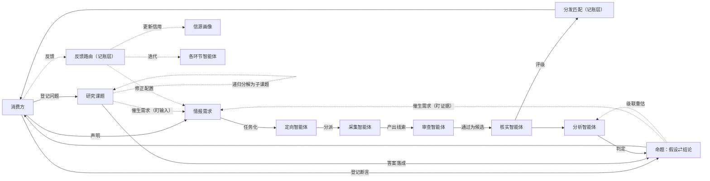
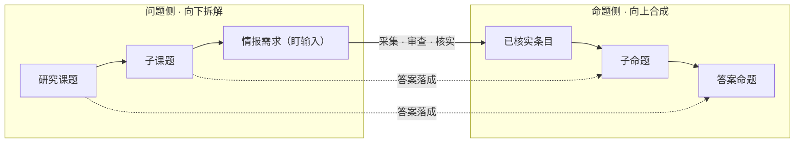
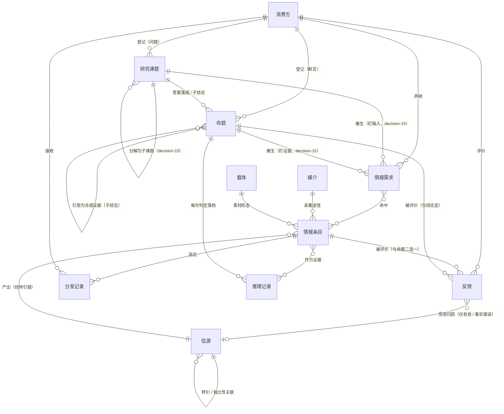
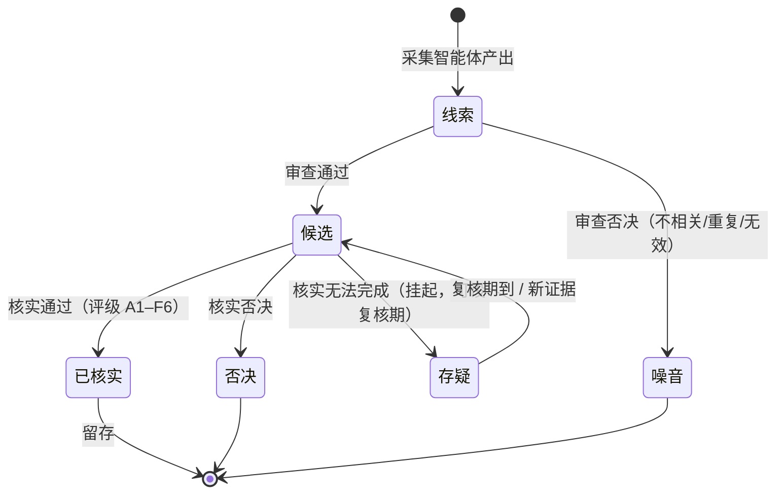
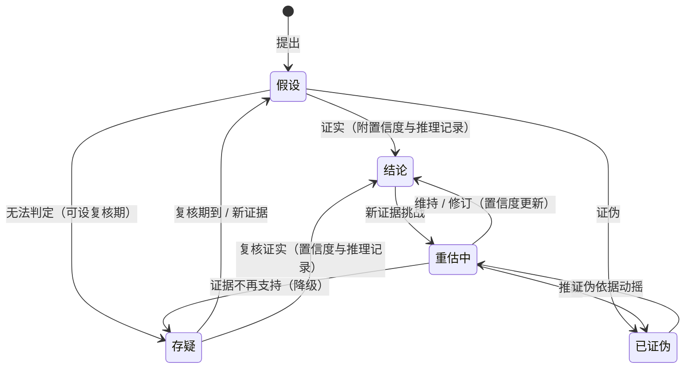
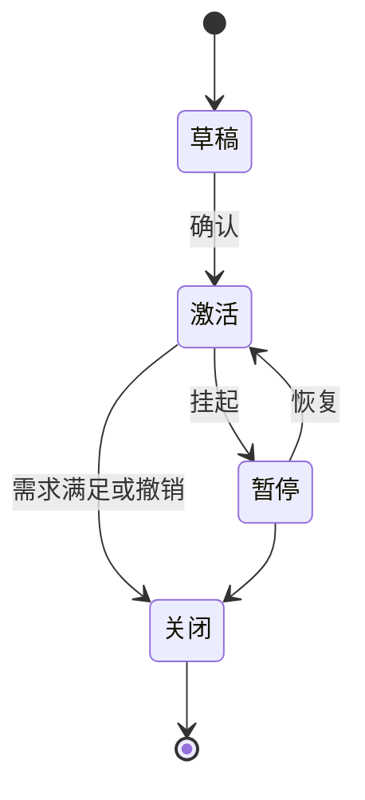
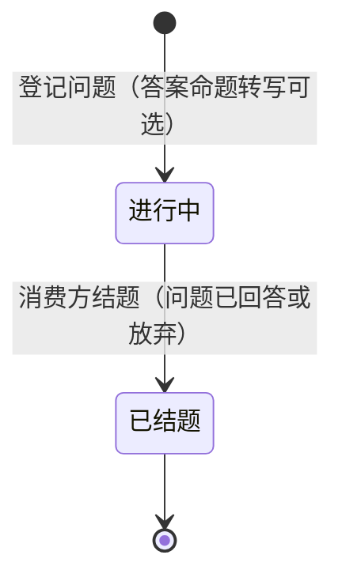

# IIH 领域模型

> 术语以[术语表](doc-03%20-%20术语表-Glossary.md)为准，本文不重复定义；架构分层见 decision-01，全部决策见 `backlog/decisions/`。

## 1. 总览

一句话：**媒介是"在哪儿拿到的"，载体是"什么形态"，信源是"谁说的"，情报是"说了什么"，研究课题是"想知道什么"，命题是"信什么、求证什么"。**

系统 = 经典情报循环（定向 → 采集 → 处理 → 分析 → 分发 → 反馈）的智能体化 + 类型化反馈闭环，全景见 §2。

## 2. 流水线与闭环

**拆解与合成，一降一升**（decision-15 的骨架）：研究课题侧自上而下——消费方登记研究课题，定向智能体按附件递归分解为子课题与情报需求（盯输入）；命题侧自下而上——叶子课题的答案从已核实条目判定（求证核实），非叶子课题的答案取子命题按框架合成（逻辑合成）。两线在每层「答案落成」处衔接：拆解产出的是**问题**，落成的才是**命题**；置信度沿命题合成 DAG 向根命题逐层计算，情报作废沿同一 DAG 触发级联重估。研究课题只管问题生命周期，命题独立存续、不受结题影响；独立登记的断言不挂研究课题，直接进命题侧求证。

### 2.1 智能体分工

| 智能体 | 输入 | 输出（提案） |
|---|---|---|
| 定向 | 情报需求、研究课题（可含附件） | 采集任务：目标信源与媒介、检索参数、采集节奏；研究课题递归分解为子课题与情报需求（v1 手动 / v2 自动提案） |
| 采集 | 采集任务、原始素材（处理管线按载体：ASR / OCR / 解析） | 线索：陈述内容 + 溯源引用 |
| 审查 | 线索 | 候选，或否决为噪音（附理由） |
| 核实 | 候选，可检索外部信源佐证 | 评级（A1–F6）；无法完成则挂存疑，判定不实则否决 |
| 分析 | 已核实条目 / 子命题、答案命题 | 判定命题：证实 / 证伪 / 存疑，附置信度与推理记录；合成命题按框架取子命题合成 |

智能体不直接写账，输出一律为提案（产出 + 依据），经记账层校验后落账，无溯源不落账（decision-01）。分发匹配、反馈路由、信用计算为记账层确定性机制，不设智能体——五类智能体即流水线上的全部判断点。各智能体的无状态工具（抓取 / 解析 / 检索 / 存储读写）属工具层，清单属实现设计，随实现另行沉淀。

## 3. 实体与关系

**走查示例**——「W 公司合资传闻核实」：用户（消费方）声明一个常驻情报需求、登记一条断言，一条业务路径走到图中大部分关系，约束仍以图为准：

| 实体 / 关系 | 本例 |
|---|---|
| 情报需求 · 声明 | R1「长期跟踪 W 公司动态」（常驻） |
| 命题 · 登记 | 听到合资传闻——世界递来的断言——登记 C1「W 与 Z 将成立合资公司」，先为假设（decision-15） |
| 命题 · 催生 | C1 催生情报需求 R2「盯 W / Z 官方公告动向」，窗口至判定（decision-15） |
| 信源 · 转引 / 独立性 | S2 = W 官网（一次信源）；S1 = 行业资讯站，转载 S2——同链只计 **1 个独立信源** |
| 媒介 / 载体 | 互联网 / 网页，记入溯源 |
| 情报条目 · 产出 | I1 = 事件级合并后的一条情报（核心陈述：W 与 Z 合资；转引链含 S1 转载与 S2 公告原文，各家原文以快照留存） |
| 命中（多对多） | I1 同时命中 R1 与 R2 |
| 推理记录 · 证据 | 分析智能体判定答案命题 C1 证实（置信度：中），引用 I1；C1 转为结论 |
| 反馈 · 信用归因 | 用户对 I1 标「有效」→ 归因到链上最早陈述方 S2：S2 信用 ↑，如实转载的 S1 不动（decision-08） |

本例未走到：事实错误打在结论命题上 → 直接进入重估中（§6）；研究课题线（登记 · 分解 · 盯输入 · 答案落成）见下方问题树走查。

**问题树走查**——「自动装车市场空间有多大」（疑问句，decision-15）：定向智能体按附件（测算框架）将 T2 分解为子课题（各测算法）+ 叶子情报需求；各子课题催生 IR → 采集 → 已核实情报入库 → 分析智能体判定出子命题；父课题分析智能体取子命题按交集定值框架合成父命题。底层情报作废 → 子命题变 → 父命题级联重估。

| 实体 / 关系 | 本例 |
|---|---|
| 研究课题 · 登记 | T2「自动装车市场空间有多大？」 |
| 研究课题 · 分解 | T2 分解为子课题 T2a「单元存量法」、T2b「工作量产能法」… + 叶子 IR「特大型矿座数」等（decision-15） |
| 子课题 · 催生 | T2a 催生 IR「单元数 / 配置区间」，采集后已核实情报入库 |
| 子命题 · 合成证据 | T2a 分析判定出子命题 C2a「1,351–3,336 台」；C2b「1,620–3,500 台」 |
| 父命题 · 合成 | T2 分析智能体取各子命题 + 交集定值框架 → 父命题 C2「1,600–3,300 台（置信度中）」 |
| 级联重估 | 「矿卡保有量」情报作废 → C2a 重估 → C2 父命题重估（沿合成 DAG） |

属性级数据设计见[数据设计](doc-04%20-%20数据设计-Data-Design.md)。

## 4. 状态机

### 4.1 情报条目

要点：判定不实才否决——能完成评定的给弱评级（4–6）仍为已核实，核实无法完成才挂存疑；「噪音」限同源纯重复，跨信源同事件是印证，放行核实合并（decision-10）。**作废是标记位非状态**：打在已核实条目上、保留原状态，触发级联重估与翻案警报（decision-11）。**分发与消费按分发记录记账**（条目 × 消费方，含命中需求、渠道、送达 / 反馈时间），需求覆盖以其统计，条目状态不承载分发进度。

### 4.2 命题

要点：命题有独立状态机，锚点为命题本身（decision-15）；判定 = 出答案——叶子命题从情报、合成命题从子命题合成；每次状态迁移都落一条推理记录。结论是命题当前生效的判定，下游引用取当前值；已证伪默认稳态留底（负知识：避免重复提出、辅助排除）。

### 4.3 情报需求

### 4.4 研究课题

要点：研究课题只管问题生命周期（进行中→已结题），判定/置信度/推理记录归命题（状态机见 §4.2）；答案落成命题，可继续被引用与翻案，不受研究课题结题影响；研究课题可递归分解为子课题，结题即关催生的子需求与子课题，保留全部历史（decision-15）。子课题亦可单独结题（先行答出或放弃，如某测算法走不通），即关其催生的子需求，父课题按剩余子命题合成；结题后命题仍会被级联重估，需新证据时由消费方就该命题催生需求（盯证据）补采（两类催生见 §2）。

## 5. 评级体系（Admiralty / NATO 二维制）

| 维度 | 评级 | 维护者 |
|---|---|---|
| 信源可靠度 | A 完全可靠 ｜ B 通常可靠 ｜ C 相当可靠 ｜ D 通常不可靠 ｜ E 不可靠 ｜ F 无法判断 | 信源画像（反馈驱动） |
| 内容可信度 | 1 已被独立信源证实 ｜ 2 很可能为真 ｜ 3 可能为真 ｜ 4 可疑 ｜ 5 不太可能 ｜ 6 无法判断 | 核实智能体（独立信源交叉） |

两维正交，书写形如 **B2**（选型依据见 decision-06）。

### 5.1 评级重评（decision-07）

已核实条目可由核实智能体重新评定，经提案落账；评级历史版本化保留（可重放），下游引用取当前值。触发器：新印证合并（decision-02）｜信源信用分档迁移（decision-04）｜人工触发｜评级异议（§6）。

## 6. 反馈类型与路由

反馈的后果分两层：**处置**（对被评价目标的即时动作：作废、重估、重评）与**学习**（三通路：信源信用、需求/采集配置、智能体迭代）。只有有效 / 事实错误动信用，经信用归因（decision-08）落到唯一责任信源；结论反馈（打在结论命题上）仅作用于结论态，除事实错误触发重估外不改信用与配置；反馈默认可信（单人前提），多消费方出现时另行决策重启。推送内一键反馈以「快捷 · {类型}」为默认理由，Web 可补写，事实错误必填（decision-11）。

| 反馈类型 | 处置（对目标） | 信用 | 配置 | 迭代 |
|---|---|---|---|---|
| 有效 | — | ↑ | 正向微调 | — |
| 事实错误 | 条目 → 作废并级联重估；结论（答案）→ 直接进入重估中 | ↓↓ | — | 核实收紧（独立信源计数要求提高） |
| 不相关 | — | — | 需求 / 采集修正 | — |
| 过期 | — | — | 采集频率、时效参数 | — |
| 重复 / 噪音 | — | — | — | 审查（去重 / 初筛） |
| 评级异议 | 触发评级重评（§5.1） | — | — | — |
