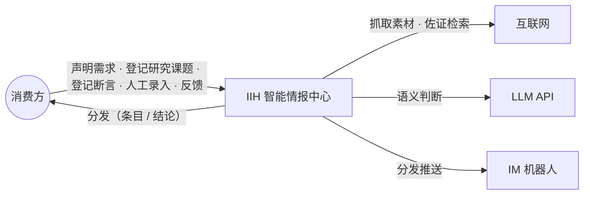
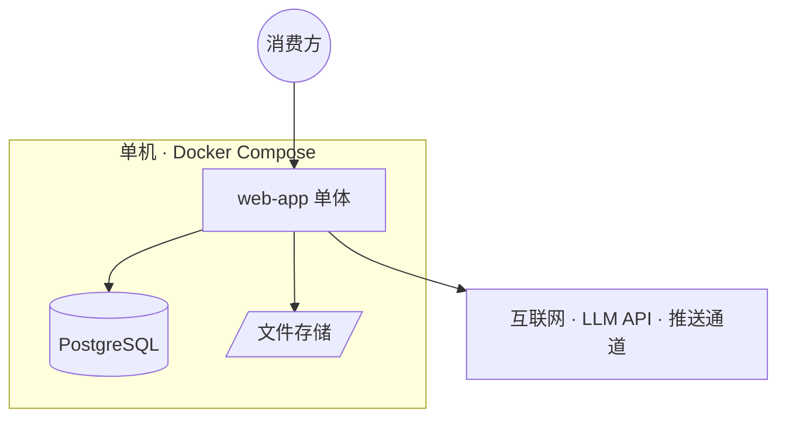
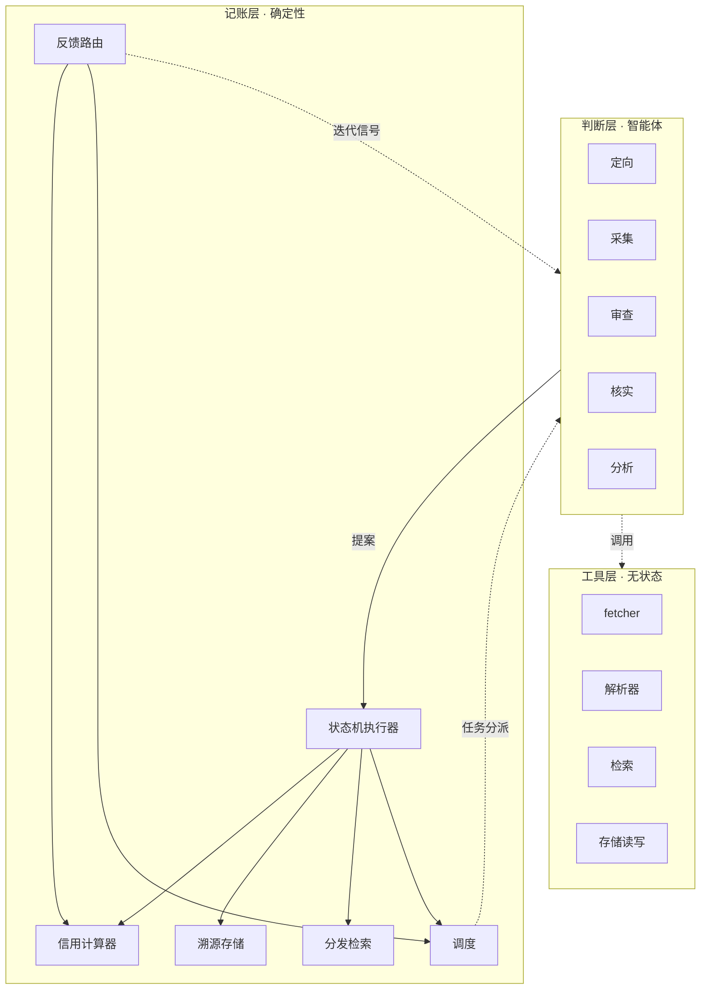

# IIH 技术架构

> decision-01 三层原则的完整落地：C4 由外到内（上下文 → 容器 → 模块），加提案契约与关键交互流。领域概念见领域模型（doc-02），数据结构见数据设计（doc-04），智能体判定依据与边界见智能体规约（doc-06）；术语以术语表为准。
> 技术选型（Python/FastAPI、PostgreSQL、Docker Compose 单机）经裁决采纳（2026-09-08），暂不落 decision；开放问题见 §8。

## 1. 选型原则

由立项文档 §7 工程纪律推导，技术决策一律服从：

| 准则 | 来源 |
|---|---|
| 组件最少化：默认单机单体，引入新部署组件须论证 | 自部署组件最少化 |
| 单语言单仓库：全栈一门语言，缩小单人维护面 | 单人开发 + AI 辅助 |
| 外购外服务优先：LLM 走 API 不自建推理；队列与缓存复用数据库，不引入独立中间件 | 组件最少化 + LLM 成本 |
| 状态可打包：全部状态在数据库与文件目录，迁移 = 代码库 + 备份 + 目录 | 一切资产代码化/配置化 |
| 成本可观测：每次 LLM 调用计量入账（智能体、对象、token） | LLM 成本由确定性前置过滤控制 |

## 2. 系统上下文（C4 L1）

| 外部系统 | 用途 | 失败时 |
|---|---|---|
| 互联网 | 素材抓取（已准入信源与池外探索）、佐证检索 | 采集任务由调度重试；核实无佐证按公式给弱评级或存疑 |
| LLM API | 判断层全部语义判断 | 提案不产生，任务回队重试 |
| IM 机器人（推送通道） | 需求分发与翻案警报；站内收件箱兜底（decision-11，产品 = 用户日常 IM，实现时定） | 送达不落分发记录，重试 |

要点：语义判断全部依赖 LLM API，但**记账层不依赖**——LLM 不可用时系统降级为"记账与分发检索照常、生产暂停"，已落账数据无损。

## 3. 容器（C4 L2）

| 容器 | 承载 | 选型 | 理由 |
|---|---|---|---|
| web-app | 记账层六模块（§4）、五类智能体执行编排、工具层、HTTP API 与薄 Web UI | Python 单体（FastAPI + SQLAlchemy + Alembic） | 判断层与工具层依赖 AI 生态（LLM SDK、ASR/OCR/解析管线），Python 覆盖最全；单人单语言维护面最小 |
| PostgreSQL | 溯源存储：情报条目、命题、推理记录、反馈、信源与画像；调度任务；LLM 调用计量 | PostgreSQL | 提案"校验 → 迁移 → 落账"需事务原子性；分发检索免独立检索引擎，同库满足 |
| 文件存储 | 原文快照、录音/图片等原始素材 | 本地目录（挂载卷），S3 兼容接口留后 | 快照仅内部留存（立项 §8）；量级单机可容 |

关键取舍：

- **单体不拆微服务**：流水线各环节经记账层中转、本无横向耦合（§4），拆分只增加部署面；负载超单机再拆（触发条件见 §9）。
- **不引入消息队列/缓存中间件**：调度的事件触发在进程内传递，定时与待办任务以 PG 任务表持久，行级锁消费即够；多一个 Redis 多一个要运维的状态组件。
- **不建 LLM 网关容器**：SDK 直连，密钥走环境变量；调用计量入 PG，独立网关在当前调用量下属过度设计。

## 4. 模块划分（C4 L3）

判断层五类智能体见智能体规约（doc-06），无状态调用、输出提案、智能体间不直接通信，全部经记账层中转。工具层为无状态功能，作为智能体工具被调用，清单随实现另行沉淀。English 命名：判断层 Judgment Layer｜记账层 Ledger Layer｜工具层 Tool Layer｜提案 Proposal（契约 §5）。

记账层六个模块：

| 模块 | English | 职责 | 关键不变量 |
|---|---|---|---|
| 状态机执行器 | State Machine Executor | 接收提案 → 校验 → 执行状态迁移 → 落账 | 唯一写账入口 |
| 信用计算器 | Credit Calculator | 按 decision-04 公式计算信用分档 | 同一反馈历史 → 同一信用值（可重放） |
| 溯源存储 | Provenance Store | 情报条目、命题、推理记录、反馈的持久化 | 无溯源不落账 |
| 分发检索 | Dissemination Search | 需求匹配、消费方推送 | 已核实才可分发 |
| 调度 | Scheduler | 智能体任务分派、采集节奏、存疑复核、评级重评与级联重估触发（decision-03/07/11） | 事件驱动优先，定时兜底 |
| 反馈路由 | Feedback Router | 类型化反馈分发到三通路、接收信用归因提案（decision-08） | 仅有效/事实错误动信用 |

代码分包镜像此划分：记账层六模块各自成包、对外接口即提案契约（§5）；判断层每类智能体一个执行器包；工具层按载体归组。

## 5. 提案契约

智能体对记账层的写入一律为提案，统一结构：

| 字段 | 内容 |
|---|---|
| 类型 | 提案类型签名（如「情报条目新建」「命题判定」「信用归因」） |
| 产出 | 目标实体的字段值 |
| 依据 | 判断的证据引用与推理过程 |
| 溯源 | 情报类提案：信源引用 + 载体 + 媒介 + 采集时间 + 原文快照/链接；其余类型：所依据实体与证据的引用 |
| 公式版本 | 涉及公式判定时记入 |

校验→落账流程：智能体提交提案 → 状态机执行器按类型校验（字段完整性、状态前置条件、溯源必填）→ 通过则执行迁移、写入溯源存储、触发下游；失败则驳回，状态不变。**无溯源不落账**由校验阶段强制。

## 6. 关键交互流

**情报生产主路径**：采集产出线索提案 → 落账为「线索」→ 调度分派审查 → 审查提案（候选/噪音）→ 核实提案（评级/否决/存疑挂起）→ 落账并触发分发检索匹配需求 → 推送消费方。每步独立提案，任一环节失败不影响前序已落账状态。

**命题生产主路径**：消费方登记研究课题（可附提示词）→ 定向智能体递归分解为子课题与盯输入情报需求 → 叶子需求驱动情报线产出已核实条目 → 叶子课题分析智能体从已核实条目判定子命题（求证核实）→ 父课题分析智能体取子命题按框架合成答案命题（逻辑合成）；每次判定落推理记录、置信度由公式给出（数据设计 §2.2）。拆解产出的是问题、落成的才是命题；课题结题只关问题线，命题独立存续、可翻案。

**翻案与级联重估**：情报条目作废 → 调度触发级联重估 → 引用它的命题进入重估中 → 分析智能体重判 → 结论沿合成 DAG 向根命题逐层传播（每层落推理记录）；结论翻案触发推送警报（decision-11），需补证据时消费方就命题催生盯证据情报需求。

**反馈与信用闭环**：消费方反馈 → 反馈路由按六类型分流（路由表见领域模型 §6）；信用通路为信用归因提案（判断层判定责任信源）→ 信用计算器更新——归因是判断、更新是确定性计算，分离保证可重放。

## 7. 部署与运维

- 部署：Docker Compose 单机（web-app + postgres + 卷挂载），调度常驻支撑无人值守。
- 迁移 = 代码库 + PG 逻辑备份 + 文件目录，三者即全部资产（§1"状态可打包"）。
- 密钥（LLM API key 等）走环境变量，不落库、不入 git。
- 横切：LLM 调用计量（§1）、结构化日志随容器 stdout 收敛、PG 定时备份。

## 8. 质量保障

| 环节 | 选型 | 理由 |
|---|---|---|
| 测试 | pytest + pytest-cov | 单一框架覆盖单元与集成；覆盖率全仓口径起步、代码库变大后切增量口径（doc-08 口径说明） |
| 静态检查 | ruff（lint + format）、mypy（基础档） | ruff 单工具覆盖 lint 与格式化；mypy 基础档起步、随代码库收紧 |
| CI | GitHub Actions | push 到 main 触发；门禁顺序 ruff check → ruff format --check → mypy → pytest --cov（--cov-fail-under=80），任一失败即红 |

门禁随首个奠基故事（IIH-03.01，承载工程骨架与 CI 基线工作包）建立，此后持续生效；豁免规则见 doc-08。

## 9. 开放问题

| 开放问题（实现前裁决） | 时点 |
|---|---|
| 中文检索方案（PG 分词插件 vs 应用层分词） | 需求匹配实现前 |
| 拆分 worker 容器 | 单机负载饱和，或流水线并发受进程模型限制时 |
