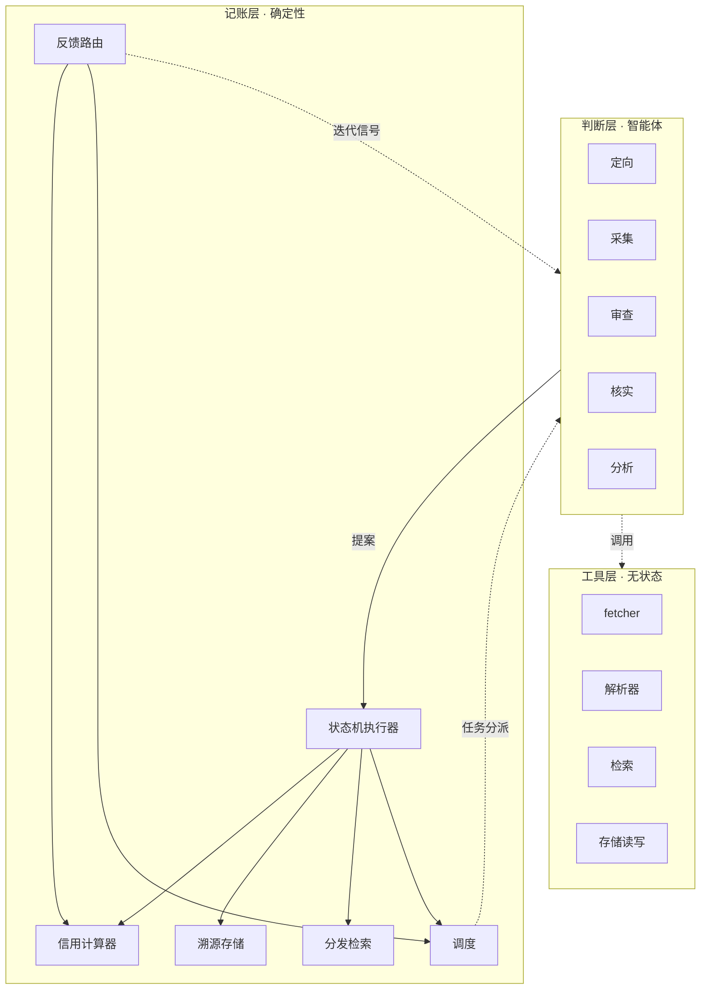

# IIH 概念架构

> 三层原则见 decision-01；本文将其落为模块边界与接口契约，作为领域模型（doc-02）与实现之间的桥梁。术语以术语表为准。

## 1. 模块划分

判断层五类智能体见领域模型 §2.1，无状态调用、输出提案、智能体间不直接通信，全部经记账层中转。工具层为无状态功能，作为智能体工具被调用，清单随实现另行沉淀。

记账层六个模块：

| 模块 | 职责 | 关键不变量 |
|---|---|---|
| 状态机执行器 | 接收提案 → 校验 → 执行状态迁移 → 落账 | 唯一写账入口 |
| 信用计算器 | 按 decision-04 公式计算信用分档 | 同一反馈历史 → 同一信用值（可重放） |
| 溯源存储 | 情报条目、命题、推理记录、反馈的持久化 | 无溯源不落账 |
| 分发检索 | 订阅匹配、消费方推送 | 已核实才可分发 |
| 调度 | 智能体任务分派、采集节奏、存疑复核与评级重评触发（decision-03/07） | 事件驱动优先，定时兜底 |
| 反馈路由 | 类型化反馈分发到三通路、接收信用归因提案（decision-08） | 仅有效/事实错误动信用 |

## 2. 提案契约

智能体对记账层的写入一律为提案，统一结构：

| 字段 | 内容 |
|---|---|
| 类型 | 提案类型签名（如「情报条目新建」「命题判定」「信用归因」） |
| 产出 | 目标实体的字段值 |
| 依据 | 判断的证据引用与推理过程 |
| 溯源 | 情报类提案：信源引用 + 载体 + 媒介 + 采集时间 + 原文快照/链接；其余类型：所依据实体与证据的引用 |
| 公式版本 | 涉及公式判定时记入 |

校验→落账流程：智能体提交提案 → 状态机执行器按类型校验（字段完整性、状态前置条件、溯源必填）→ 通过则执行迁移、写入溯源存储、触发下游；失败则驳回，状态不变。**无溯源不落账**由校验阶段强制。

## 3. 关键交互流

**情报生产主路径**：采集产出线索提案 → 落账为「线索」→ 调度分派审查 → 审查提案（候选情报/噪音）→ 核实提案（评级/否决/存疑挂起）→ 落账并触发分发检索匹配订阅 → 推送消费方。每步独立提案，任一环节失败不影响前序已落账状态。

**反馈与信用闭环**：消费方反馈 → 反馈路由按六类型分流（路由表见领域模型 §6）；信用通路为信用归因提案（判断层判定责任信源）→ 信用计算器更新——归因是判断、更新是确定性计算，分离保证可重放。

## 4. 不在本文展开

技术栈与部署 → 技术架构文档（待定）；工具层具体清单 → 随实现沉淀；智能体判定依据与边界 → 智能体规约（doc-06），prompt 与模型选型同属实现；数据结构细节 → 数据设计 doc-04。
