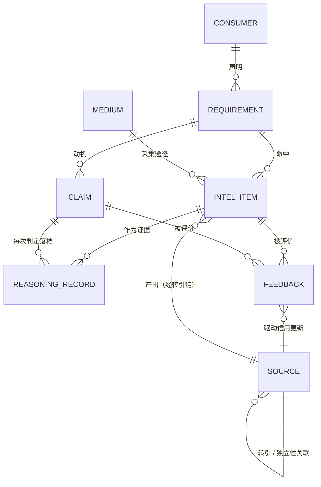
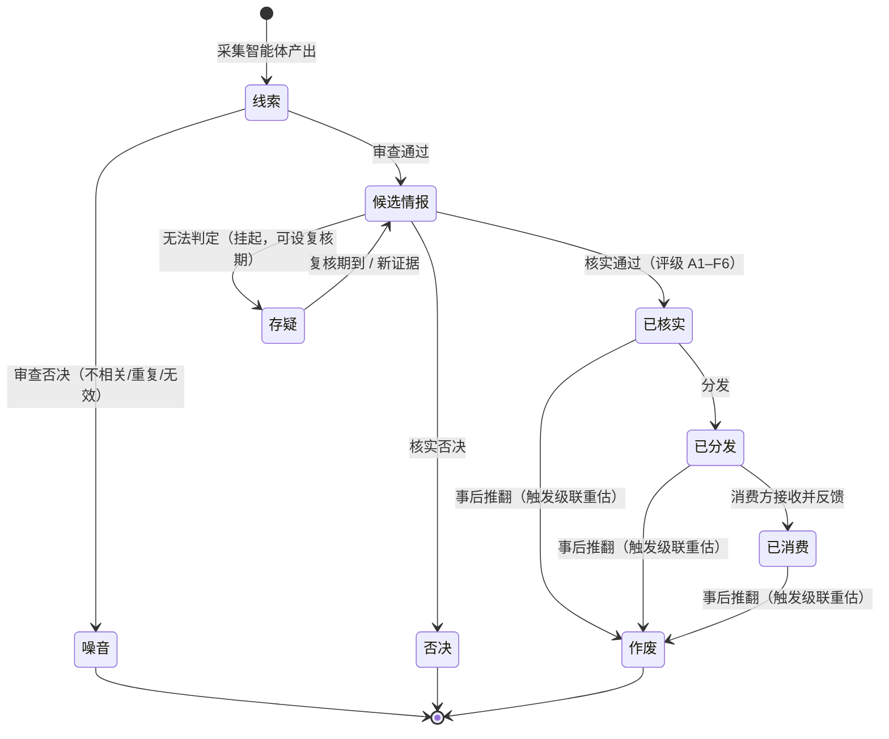
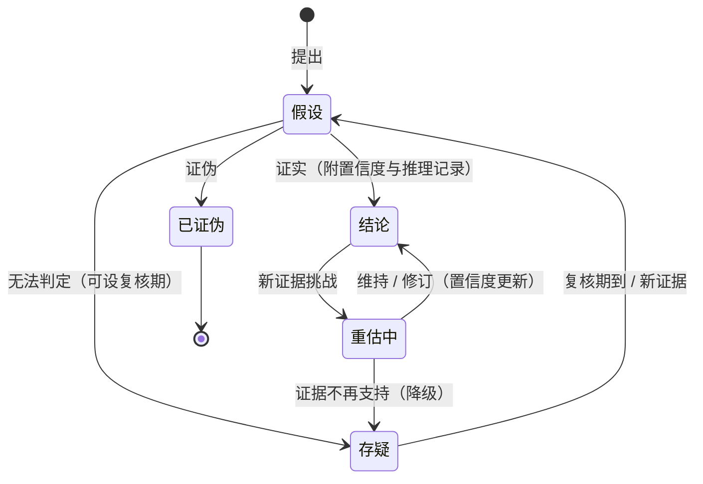
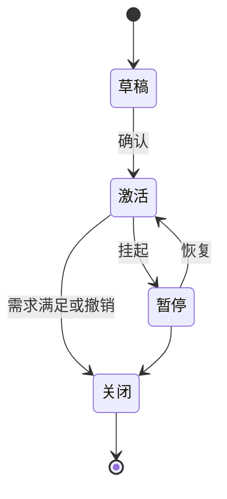
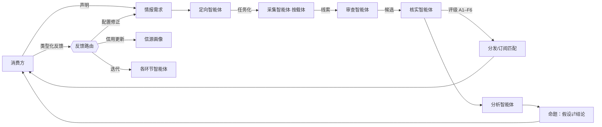

# IIH 领域模型

> 术语以[术语表](glossary.md)为准，本文不重复定义。

## 1. 总览

一句话：**媒介是"在哪儿拿到的"，载体是"什么形态"，信源是"谁说的"，情报是"说了什么"，命题是"我们信什么"。**

系统 = 经典情报循环（定向 → 采集 → 处理 → 分析 → 分发 → 反馈）的智能体化 + 双通道反馈闭环，全景见 §6。

## 2. 实体与属性

| 实体 | 核心属性 | 说明 |
|---|---|---|
| 媒介 | 名称、描述 | 获取场景的封闭小集合；采集模式（自动拉取 / 人工提交）由媒介派生 |
| 载体 | 名称、处理管线（ASR / OCR / 解析） | 素材形态的封闭小集合；采集智能体按载体分类 |
| 信源 | 标识、类型（机构/站点/人物）、画像、信用（A–F）、独立性关联 | 信用是画像的动态字段 |
| 情报需求 | 提出方、类型（订阅/任务）、内容规格、生效窗口、状态 | 内容规格 = 主题、关键词、信源偏好、时效要求等 |
| 情报条目 | 陈述内容、溯源（信源引用+载体+媒介+采集时间+原文快照/链接）、事件时间、评级、状态、命中需求 | 溯源含完整转引链；原文留存不可变 |
| 命题 | 陈述、当前状态、置信度、推理记录列表、关联需求 | 假设/结论/已证伪/存疑是同一实体的状态 |
| 反馈 | 类型、理由、目标（情报条目或命题）、评价方、时间 | 五类型见 §7 |

## 3. 实体关系

## 4. 状态机

### 4.1 情报条目

### 4.2 命题

要点：**结论不是终点态，是"当前生效"态**。每次状态迁移都落一条推理记录。

### 4.3 情报需求

## 5. 评级体系（Admiralty / NATO 二维制）

| 维度 | 评级 | 维护者 |
|---|---|---|
| 信源可靠度 | A 完全可靠 ｜ B 通常可靠 ｜ C 相当可靠 ｜ D 通常不可靠 ｜ E 不可靠 ｜ F 无法判断 | 信源画像（反馈驱动） |
| 内容可信度 | 1 已被独立信源证实 ｜ 2 很可能为真 ｜ 3 可能为真 ｜ 4 存疑 ｜ 5 不太可能 ｜ 6 无法判断 | 核实智能体（独立信源交叉） |

书写形如 **B2**。第一维由反馈闭环驱动，第二维由核实环节评定——对应系统的两条反馈通路。

## 6. 流水线与闭环

## 7. 反馈类型与路由

| 反馈类型 | 更新信源信用 | 更新需求/采集配置 | 迭代智能体 | 其他动作 |
|---|---|---|---|---|
| 有效 | ↑ | 正向微调 | — | — |
| 事实错误 | ↓↓ | — | 核实阈值收紧 | 情报作废 → 级联重估涉事结论 |
| 重复/噪音 | — | — | 审查（去重/初筛） | — |
| 不相关 | — | 需求/采集修正 | — | — |
| 过期 | — | 采集频率、时效参数 | — | — |

## 8. 架构与决策

架构分层见 [ADR-01](adr/01-架构分层.md)：判断归智能体，记账归确定性系统；智能体写入一律为提案，经校验落账。其余决策见 `docs/adr/`。
